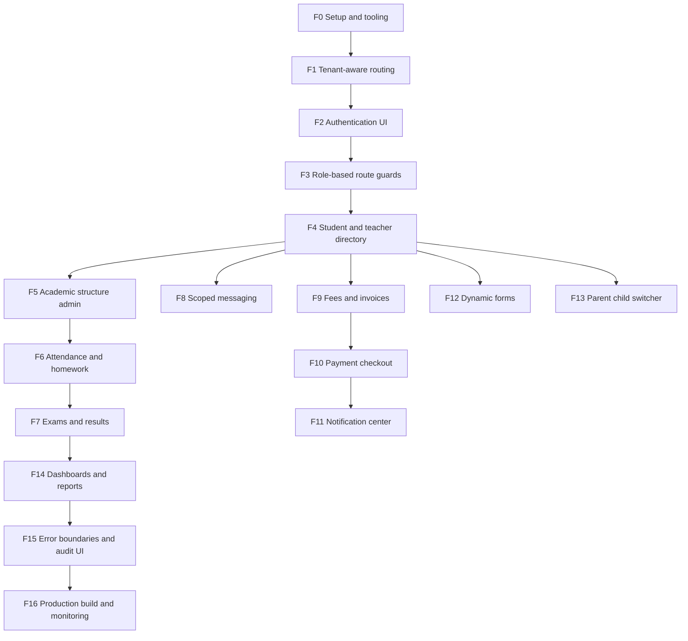

# CampusOS Architecture

This repository follows `academic-saas-fullstack-devplan.md` from the project blueprint. Work is intentionally phase-gated: finish and validate each frontend phase before starting backend work.

## Current Phase

### F2: Authentication UI

- `/login` preserves the resolved tenant slug in the server-rendered form context.
- Login requests use `credentials: include` and expect an httpOnly server session; the browser never stores access tokens in application state.
- Invalid credentials, unavailable auth service, submitting, and forced password reset states are represented in the UI.
- `/reset-password` provides a forced-reset form and password recovery requests use a neutral response to avoid account enumeration.

### F3: Role-based route guards

- `/workspace` is protected by a lightweight cookie redirect for UX and a server-side `/auth/session` check for the actual session contract.
- Role navigation only controls visible links; every destination remains backend-authorized.
- The frontend does not decode or trust browser-supplied role claims.
- Frontend role visibility remains cosmetic; the backend must independently enforce identity, tenant, and permission checks.

### F1: Tenant-aware routing

- Middleware resolves the tenant slug from the request hostname.
- The resolved slug is forwarded as request-scoped headers, never trusted from a client form field.
- Local development uses the `demo` tenant; production subdomains use the first hostname segment.

### F0: Frontend setup and tooling

- Next.js App Router with TypeScript
- Tailwind CSS v4
- ESLint and TypeScript validation scripts
- Product shell and shared visual language
- No secrets committed; use `.env.example` for future configuration

The current screen is a non-authenticated foundation shell. It does not claim tenant identity or enforce permissions. Those responsibilities begin in F1 and the backend security phases.

## Frontend Order



## Backend Order

FastAPI, PostgreSQL, async SQLAlchemy/Alembic, Redis/Celery, Argon2id authentication, backend-enforced RBAC, tenant-scoped queries, audit logging, and deployment follow the backend dependency graph in the source blueprint. Backend implementation starts only after the relevant frontend phase has passed its checks.

## Non-negotiable Rules

- Every tenant-owned query carries a mandatory `tenant_id` filter.
- Frontend route guards are UX only; backend endpoints re-check role and resource scope.
- Secrets stay out of Git; commit only `.env.example` placeholders.
- Payment data uses PSP-hosted/tokenized fields; raw card data is never stored.
- Sensitive notification content uses a tap-to-view pattern.
- Audit logs are append-only and tenant-scoped.

## Validation Gate

Before advancing a phase, run:

```text
npm install
npm run lint
npx tsc --noEmit
npm run build
```

At scaffold time, the local npm registry install was interrupted and the dependency binaries were unavailable. F0-F2 source diagnostics are available, but executable lint/typecheck/build validation remains blocked until dependencies install successfully.
