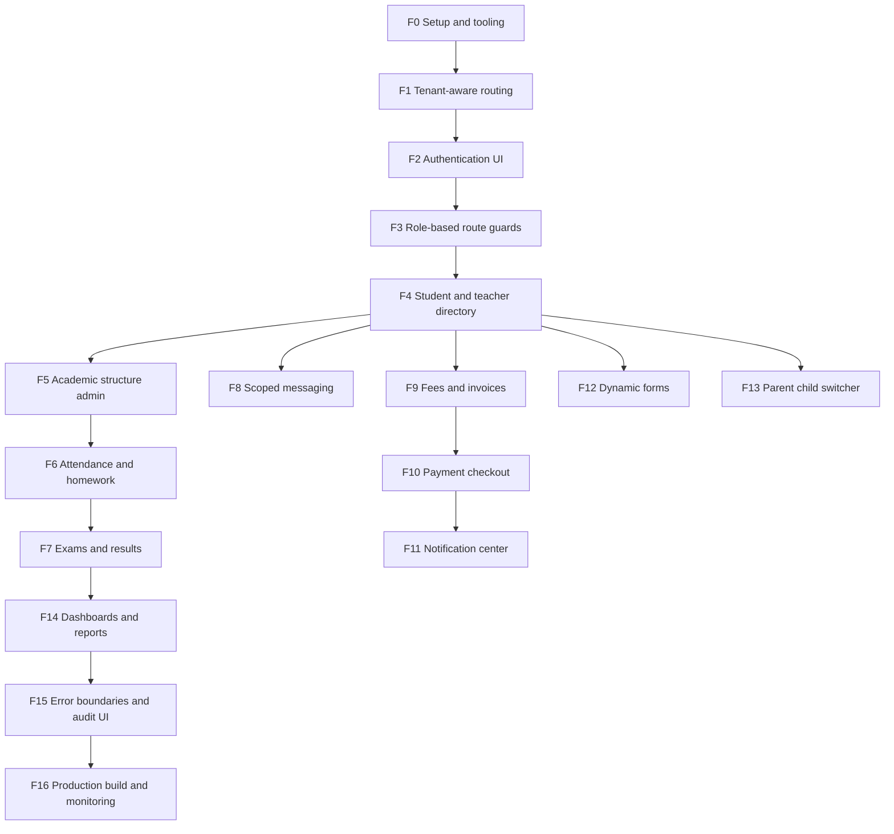

# CampusOS Architecture

This repository follows `academic-saas-fullstack-devplan.md` from the project blueprint. Work is intentionally phase-gated: finish and validate each frontend phase before starting backend work.

## Current Phase

### F2: Authentication UI

- `/login` preserves the resolved tenant slug in the server-rendered form context.
- Login requests use `credentials: include` and expect an httpOnly server session; the browser never stores access tokens in application state.
- Invalid credentials, unavailable auth service, submitting, and forced password reset states are represented in the UI.
- `/reset-password` provides a forced-reset form and password recovery requests use a neutral response to avoid account enumeration.

### F3: Role-based route guards

- `/workspace` is protected by a lightweight cookie redirect for UX and a server-side `/auth/session` check for the actual session contract.
- Role navigation only controls visible links; every destination remains backend-authorized.
- The frontend does not decode or trust browser-supplied role claims.

### Backend Phase 0: Setup and tooling

- `backend/` contains a FastAPI application factory, environment settings, and `/health` endpoint.
- Development validation uses pytest and Ruff; dependencies are declared in `backend/pyproject.toml`.
- Async SQLAlchemy session wiring and Alembic migration configuration are present without opening a database connection during import.

### Backend Phase 1: Multi-tenant foundation

- `tenants` and `tenant_settings` tables use UUID tenant ownership and a unique subdomain.
- Request hostname resolution produces a tenant context; local development defaults to `demo`.
- Tenant-scoped query construction rejects a missing `tenant_id` before SQL is executed.
- Cross-tenant isolation tests cover hostname resolution and the mandatory query predicate.
- Redis, authentication, and domain APIs are intentionally deferred to their blueprint phases; the initial tenant migration is now present.
- Frontend role visibility remains cosmetic; the backend must independently enforce identity, tenant, and permission checks.

### Backend Phase 2–3: Identity, authentication, and RBAC

- Argon2id password hashing and signed, short-lived JWT access sessions are implemented in `backend/app/security.py`.
- `/auth/login`, `/auth/session`, `/auth/logout`, password-reset contract endpoints, and httpOnly session cookies are implemented.
- Roles, permissions, user-role links, teacher assignments, tenant checks, and resource-scope checks are represented in the schema and backend permission boundary.
- The backend never trusts role or tenant identifiers from request bodies for authorization; claims are issued and checked server-side.

### Backend Phase 4–5: Identity management and academic structure

- Global student identities link to tenant-specific enrollments; transfers require an immutable consent record.
- Academic data uses tenant-scoped academic years, programs, levels, sections, and subjects with institution-type metadata rather than hardcoded grades.
- Migration `0003_identity_and_academics` and structural tests cover the hierarchy and tenant ownership requirements.

### Backend Phase 6–7: Attendance, homework, examinations, and results

- Attendance, homework, exams, and marks are tenant-owned and linked to academic scope.
- Mark scores are range-validated and converted to grades only after validation; exam publication remains an explicit state.
- Teacher assignment scope checks reject another teacher's subject/section, including crafted requests.
- Migration `0004_attendance_exams_results` and workflow tests cover the core security boundary.

### Backend Phase 8/13: Scoped messaging and parent accounts

- Conversations, participants, messages, and parent-student links are tenant-owned.
- Conversation visibility requires both the requesting user to be a participant and the tenant to match; guessing an ID is insufficient.
- Parent links are verified records and support multiple enrollments across institutions.
- Migration `0005_messaging_parent_links` and participant/tenant tests cover the isolation boundary.

### Backend Phase 9–10: Fees, invoicing, and payment infrastructure

- Fee structures, invoices, PSP-tokenized payments, transactions, receipts, refunds, and reconciliation logs are tenant-owned.
- Webhook signatures use constant-time HMAC comparison and payment requests require bounded idempotency keys.
- No raw card/account number columns exist; provider references and tokenized identifiers are the only payment fields.
- Migration `0006_fees_payments` and payment security tests cover the provider boundary.

### Backend Phase 11–12: Notifications and configurable forms

- Notification bodies are redacted to a tap-to-view message whenever sensitive markers are detected.
- Form definitions are backend-owned JSON schemas with validated field names/types; submissions are tenant-scoped.
- Migration `0007_notifications_forms` and privacy/schema tests cover the boundary.

### Cloud readiness boundary

- Frontend and backend production images, local Compose dependencies, and GitHub Actions CI are committed.
- Production secrets are environment-managed and have no insecure code defaults.
- Cloud work remaining is infrastructure execution only: managed PostgreSQL/Redis, secret injection, migration job, TLS/domains, and traffic cutover.
- CI is the required pre-deploy gate; live database credentials are intentionally not stored in this repository.

### F1: Tenant-aware routing

- Middleware resolves the tenant slug from the request hostname.
- The resolved slug is forwarded as request-scoped headers, never trusted from a client form field.
- Local development uses the `demo` tenant; production subdomains use the first hostname segment.

### F0: Frontend setup and tooling

- Next.js App Router with TypeScript
- Tailwind CSS v4
- ESLint and TypeScript validation scripts
- Product shell and shared visual language
- No secrets committed; use `.env.example` for future configuration

The current screen is a non-authenticated foundation shell. It does not claim tenant identity or enforce permissions. Those responsibilities begin in F1 and the backend security phases.

## Frontend Order



## Backend Order

FastAPI, PostgreSQL, async SQLAlchemy/Alembic, Redis/Celery, Argon2id authentication, backend-enforced RBAC, tenant-scoped queries, audit logging, and deployment follow the backend dependency graph in the source blueprint. Backend implementation starts only after the relevant frontend phase has passed its checks.

## Non-negotiable Rules

- Every tenant-owned query carries a mandatory `tenant_id` filter.
- Frontend route guards are UX only; backend endpoints re-check role and resource scope.
- Secrets stay out of Git; commit only `.env.example` placeholders.
- Payment data uses PSP-hosted/tokenized fields; raw card data is never stored.
- Sensitive notification content uses a tap-to-view pattern.
- Audit logs are append-only and tenant-scoped.

## Validation Gate

Before advancing a phase, run:

```text
npm install
npm run lint
npx tsc --noEmit
npm run build
```

The frontend and backend executable validation gates are available locally and in CI. Live PostgreSQL migration execution remains an infrastructure step because this repository does not contain database credentials.
